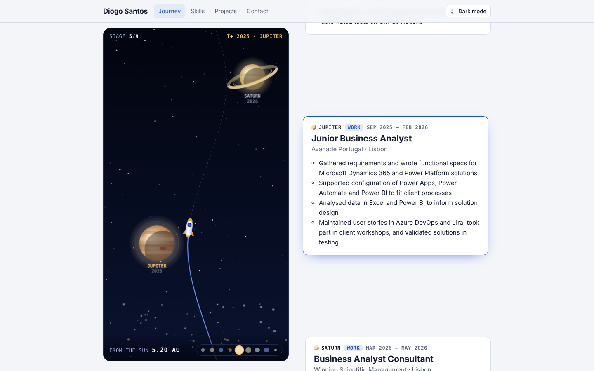
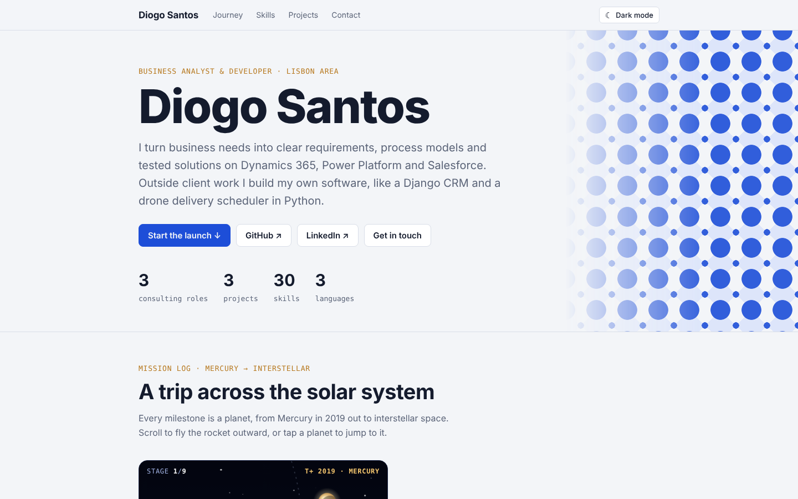
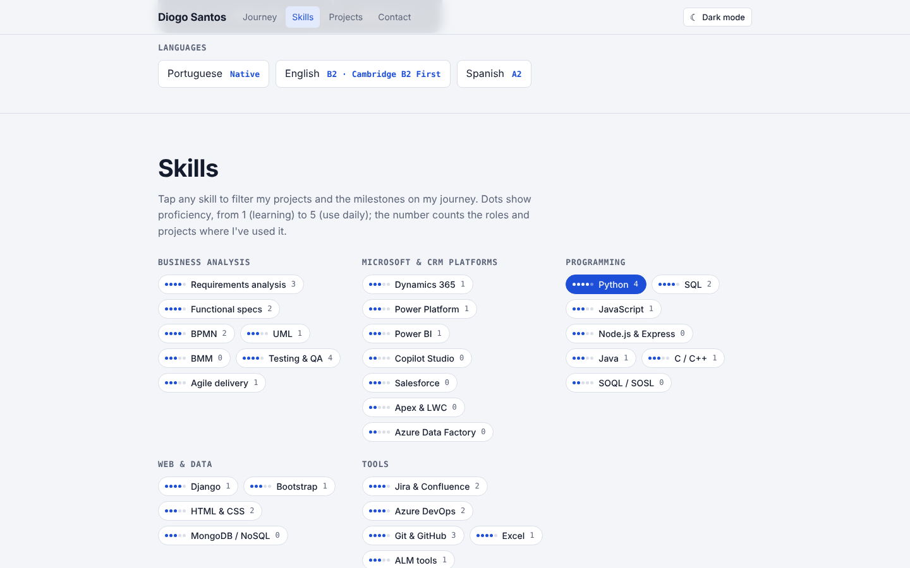
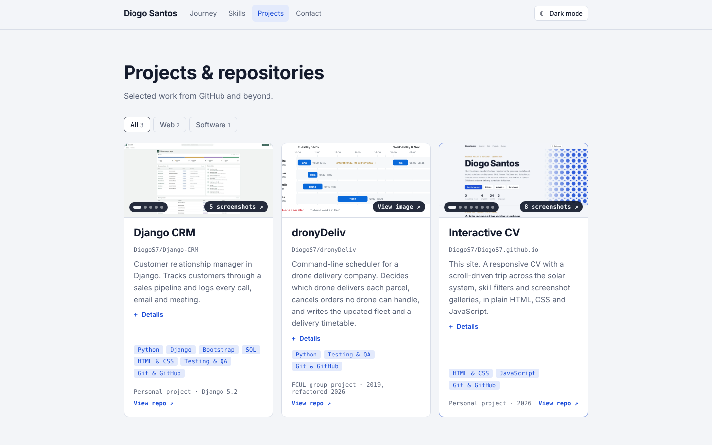
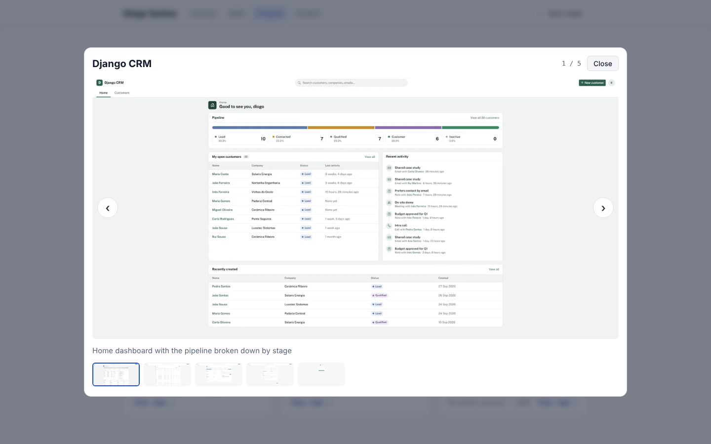
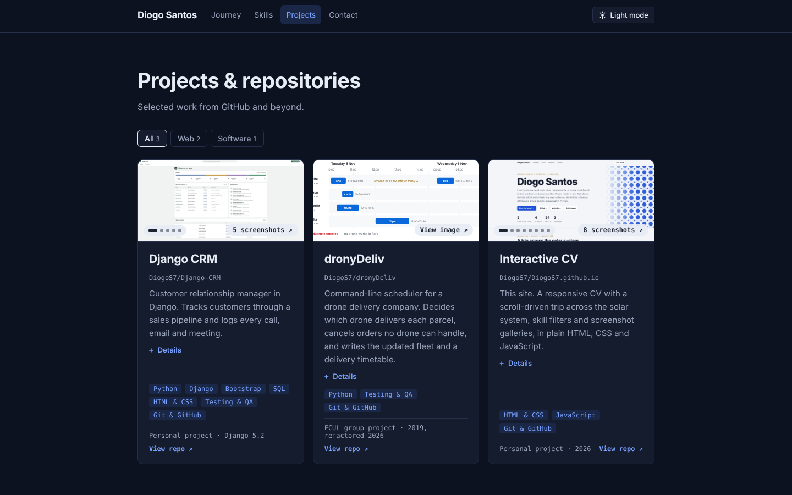
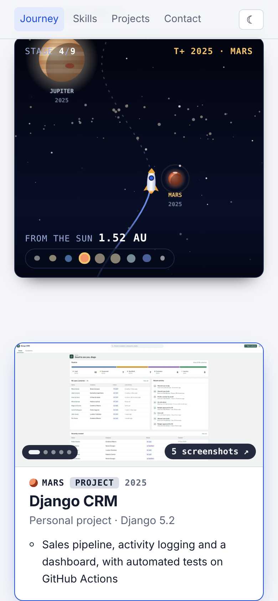

# Interactive CV

[](https://github.com/DiogoS7/DiogoS7.github.io/actions/workflows/check.yml)

My CV as a website: **[diogos7.github.io](https://diogos7.github.io)**

Scroll and a rocket flies from Mercury out to interstellar space. Every planet is a milestone in my education, work or projects. Pick a skill to see where I've used it, and open any project to browse its screenshots.



## Screenshots

| Header | Skills filter |
| --- | --- |
|  |  |

| Projects | Screenshot gallery |
| --- | --- |
|  |  |

| Dark theme | Phone |
| --- | --- |
|  |  |

## Features

- **Solar-system journey**: a canvas animation tied to scroll. The rocket stops at one planet per milestone, with the year, stage and real distance from the Sun in AU. Tap a planet or a dot in the mini-map to jump to it.
- **Skill filters**: click any skill to highlight the projects and milestones that use it.
- **Screenshot galleries**: covers cycle through screenshots on hover; click for a gallery with arrows, thumbnails, keyboard and swipe.
- **Light and dark themes**, following the system setting, with a manual toggle.
- **Responsive** from phone to desktop. On phones the flight is pinned to the top of the screen.
- **No frameworks, no build step.** Plain HTML, CSS and JavaScript, so GitHub Pages serves it as is.

## Project layout

```
index.html              page structure and link-preview tags
assets/css/styles.css   all styling, with light and dark colour tokens at the top
assets/js/data.js       ALL CV CONTENT: skills, projects, journey, languages, contact
assets/js/app.js        rendering, filters, gallery, theme toggle, solar-system flight
assets/img/shots/       project screenshots shown on the site (WebP)
assets/img/og-image.png preview image used when the link is shared (1200×627)
docs/screenshots/       screenshots for this README
```

## Updating the CV

Almost every change happens in `assets/js/data.js`:

- **New job or course**: add an entry to `journey`, in date order. The planet is assigned automatically from its position (Mercury first, interstellar space always last).
- **New project**: add it to `projects`, and add a `journey` entry with `project:"<same name>"` if it should be a stop on the flight.
- **Screenshots**: save them as WebP in `assets/img/shots/` (about 1400px wide is plenty) and list them under the project's `shots`.
- **Skills**: add them to a group in `skills`, with a level from 1 to 5. Use the same name in a project's or milestone's `skills` so the filter finds it.

The flight has room for up to nine planets plus interstellar space.

## Run it locally

Open `index.html` in a browser. Or serve the folder so paths behave exactly as on GitHub Pages:

```bash
python -m http.server 8000
# then open http://localhost:8000
```

## Publishing

The repository is named `DiogoS7.github.io`, so GitHub Pages serves it at https://diogos7.github.io from the `main` branch. Every push to `main` updates the live site within a minute or two.

`.github/workflows/check.yml` runs on every push: it checks the JavaScript parses and that every image the site references exists.
